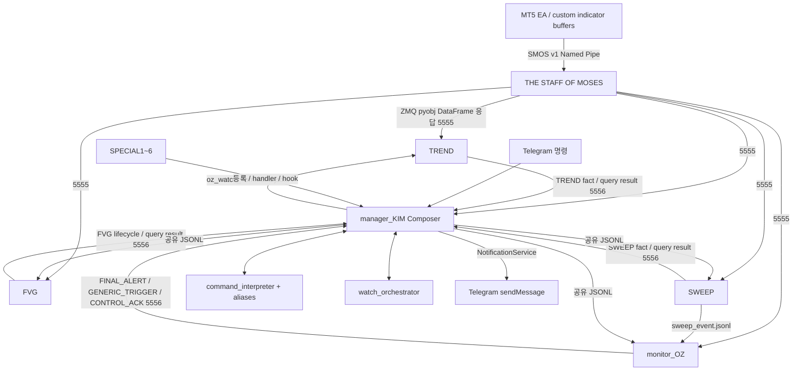

# 현재 동작 기준선 — 2026-09-19

이 문서는 전달된 파일을 유일한 기준으로 삼는다. 이전 버전 복원, 전략 개선, 운영 소스 변경은 하지 않았다. 소스에 이전 버전이 언급되어 있어도 현재 실행문만 계약으로 취급한다. **테스트 PASS는 현재 동작 재현을 뜻하며, 알려진 문제의 해결을 뜻하지 않는다.**

## 감사 범위와 기준 자료

전달 파일 28개 전체를 읽어 SHA-256/크기를 고정했다. Python/pyw 전체 AST에서 878개 class/function과 1,587개 payload·필드 읽기·분기·I/O 지점을 추출했다. 파일별 전체 함수 위치는 [source_index.json](audit/fixtures/source_index.json), 정확한 계약 사용 구문은 [contract_inventory.json](audit/fixtures/contract_inventory.json), 전체 파일 목록/해시는 [source_manifest.json](audit/fixtures/source_manifest.json)에 있다. 이 추출물은 동적 스키마의 완전한 증명이 아니라, 아래 의미 감사의 원문 탐색 색인이다.

핵심 9개 파일 외에 실제 실행에 관여하는 `SPECIAL1~6.py`, MT5 EA 및 PRICE/RSI/STO/DI 지표, GUI launcher, 설치 BAT, config, 명령 예시, 이미지 파일도 기준선에 포함했다. 이미지의 바이트 동일성은 검사하지만 UI 화면 회귀는 실행하지 않는다. Git 저장소는 없으며, 원본 불변 여부는 manifest로 확인한다. 원본 config의 토큰·chat ID·API key는 산출물에 복사하지 않는다.

## 프로세스와 흐름

`command_interpreter`와 `watch_orchestrator`는 KIM이 import하는 모듈이며 별도 프로세스가 아니다. GUI 기본 시작 순서는 STAFF(2초 간격), KIM(1초), TREND/FVG/SWEEP/OZ이다. 실행 순서가 달라질 수 있으므로 각 소비자는 명령 worker를 시작한 후 KIM에 PING한다.

## 모듈별 현재 책임

| 모듈 | 입력과 책임 | 출력/경계 | 주요 원문 위치 |
|---|---|---|---|
| THE STAFF OF MOSES | Named Pipe 전체 snapshot 캐시, 요청별 지표 건전성 검사, 공통 파생값, stale/주말 처리 | TF→DataFrame dict, error dict, PING/sigma ACK | `StaffPipeCache:117`, `apply_requested_features:524`, `DataServer:617` |
| strategy_INDICATOR (구 strategy_TREND) | HMA 포함 STAFF 데이터. 전략 추세 Fact(SMA20 시가·HMA50 기울기), 요청된 metric Fact, 요청 시에만 전체 지표 추세점수 | TREND_STATE 변화 이벤트, 1초 metric push, query | `IndicatorEngine`, `IndicatorWatchRegistry`; 계산식 `indicator_facts.py`, 추세점수 `indicator_score.py`; `strategy_TREND.py`는 호환 래퍼 |
| strategy_FVG | OHLC의 3봉 gap, 자체 ATR 필터, 확정봉 유효성, 동일 TF 진행봉 overlap | CREATED/TOUCH/TOUCH_END/FILLED/EXPIRED/query | `build_fvg_state:274`, `FVGEngine:617` |
| strategy_SWEEP | source TF 확정봉과 일/4h/8h/5m 레벨 컨텍스트 | TOUCH/INVALIDATED를 KIM과 OZ JSONL에 각각 전달 | `ExternalLiquidityDetector:660`, `SweepEngine:921` |
| monitor_OZ | 독립 OUT→IN/HMA 구조 추적, SWEEP ATR 자격, OZ profile 검증·최종 trigger, Generic watch | KIM을 통한 최종 알림·chain callback·제어 ACK | `ExternalLiquidityController:377`, `OZMonitor:2973`, `GenericConditionMonitor:2142` |
| manager_KIM | fact 저장·ALL/ANY 조합·시간필터·OZ arm·구독 조정·개인명령·공식 plugin·알림 | 공유 JSONL 명령, query 결과 알림, Telegram, 상태파일 | `ComposerManager:1698`, `_handle_event:4009`, `maintenance_tick:7591` |
| command_interpreter | alias/hot reload, 종목/TF/방향/기간/예약/intent 해석, Gemini 표현 정규화 | 문자열/descriptor/intent; 감시 실행 없음 | `CommandInterpreter:151` |
| watch_orchestrator | 개인 SEQUENTIAL/UNORDERED/FILTER chain 상태 전이·예약·expiry·CANCEL_ON | push/notify callback; 시장계산 없음 | `TimedChainSpec:449`, `WatchOrchestrator:745` |
| command_aliases.json | 외부 어휘·기본값·primitive macro | KIM의 해석 계층에 병합 | version 2, `기본더블비=TREND+WONBI` |

## 전략 의미를 고정하는 세부사항

**STAFF.** 마지막 행이 진행봉이다. time 정렬, 중복 time은 마지막 값, max bars tail, 전체 메시지 수신 후 캐시 reference 교체. 같은 연결에서 snapshot ID가 이전 이하이면 무시한다. 새 writer 연결은 sequence 기억만 초기화하고 기존 데이터와 freshness는 유지한다. 캐시는 RAM이다. base 컬럼의 존재와 요청 지표의 최근 20봉 전체 NaN 여부를 검사하지만 OHLC의 유한성/가격 관계 전체를 검증하지는 않는다.

항상 ATR14(`ewm(alpha=1/14, adjust=False, min_periods=14)`)와 WONBI(OPEN, 4, `std(ddof=0)`, sigma 3 기본)를 제공한다. MT5 EMA/HMA 값 자체를 Python에서 대체 계산하지 않는다. 요청 시 밴드 상태와 slope, SUPERTREND, 단순 FVG 파생 컬럼을 추가한다. **STAFF의 단순 FVG 컬럼과 strategy_FVG의 ATR 필터된 FVG를 동일한 판정으로 취급하면 안 된다.**

**TREND (수정본5부터 strategy_INDICATOR).** 전략 추세(TREND_STATE)는 진행봉 기준 SMA20(시가) 기울기(현재 대 1봉 전)와 HMA50 기울기(현재 대 2봉 전)가 둘 다 양수면 UP/LONG, 둘 다 음수면 DOWN/SHORT, 그 외(방향 불일치·0)는 NEUTRAL이다. 아래 전체 지표 추세점수는 Watch가 명시적으로 요청할 때(`추세점수 몇 점?`, 추세점수/롱점수/숏점수 조건)만 계산한다. 전체 지표 추세점수: 최소 60행, 진행봉 평가, 30점 분모/100점 상한, threshold 40. LONG 점수가 threshold 이상이고 SHORT보다 엄격하게 클 때 UP, 반대이면 DOWN, 나머지는 NEUTRAL이다. 26개 가중 조건의 원문은 `TrendEngine.score`가 기준이다. `hma_50`은 STAFF 원본, HMA slope는 현재 대 2봉 전이다. score 변화만으로 TREND_STATE를 재발송하지 않으며 방향 상태가 바뀌어야 한다. query의 `bar_mode=CLOSED`만 마지막 진행봉을 잘라 동일 계산을 사용한다. metric은 별도 on-demand 계약이다.

**FVG.** 확정봉만 생성 후보이며 최근 30개 확정봉(나이 0~29), BULL/BEAR별 최신 미충족 영역 3개를 추적한다. 1번봉 ATR14의 0.25~1.75배 gap을 양 끝 포함으로 인정한다. ATR은 FVG 내부 `_wilder_atr`의 SMA seed 후 Wilder 반복이며 STAFF ATR과 초기화가 다르다. BULL은 이후 확정봉 low≤bot, BEAR는 high≥top이면 fill. 진행봉의 반대편 경계 돌파만으로 fill하지 않는다. 같은 TF 진행봉 high/low와 영역의 닫힌 구간 overlap이 touch다. 첫 snapshot은 CREATED를 억제하지만 TOUCH는 보낼 수 있다. 최신 3개에서 밀림은 FILLED가 아니며 기존 touch만 종료할 수 있다.

**SWEEP.** source TF의 `-2` 확정봉만 판독한다. PDH/PDL, 이전 4H/8H 확정봉, UTC Monday 기준 직전 주의 일봉 PWH/PWL, KST 세션 레벨을 계산한다. source TF 외 `1d,4h,8h,5m`도 요청한다. 같은 봉 LONG 후보는 최저 레벨, SHORT는 최고 레벨을 대표로 내보내고 나머지는 consumed 처리한다. ATR/생존/OZ 판정은 하지 않는다. 살아있는 대표 touch만 재시작 후 KIM에 `restored=true`로 재전달하며 OZ 버스에는 다시 쓰지 않는다. 이 복구는 SWEEP 자체 재시작 시에만 준비된다.

**Composer.** ALL/ANY는 현재 fact 상태의 조합이다. WONBI/PERCENTILE/MA는 직접 STAFF를 polling한다. TREND/FVG/SWEEP은 엔진 fact만 조합한다. MA 세 종류와 TREND_METRIC에는 freshness 검사가 있지만 TREND/FVG/SWEEP/WONBI/PERCENTILE에는 같은 만료 규칙이 없다. 성공 signature는 RAM이며 `spec_id+direction+condition tokens` SHA-1이다. 동일 OZ profile은 여러 source spec을 병합한다. PRIVATE 일회성 spec은 OZ arm 시 소진되고, NOTIFY는 Telegram 성공 시 소진된다. 최종 OZ 전달 성공 후 child를 취소한다.

**OZ.** 15개 base TF(1m~4h)를 Watch 존재와 독립적으로 추적한다. RSI/STO/DI/PRICE 각각의 live OUT→IN을 관찰하며 첫 관찰 IN은 과거 OUT→IN을 만들지 않는다. HMA6/17 cross와 OUT→IN은 순서 독립이다. TRUE B0는 OUT→IN extreme와 연속 반대 HMA 배열의 pre-cross extreme 중 방향별 극값이다. 반대 cross, cross 뒤 한 방향 3개 확정봉, TRUE-B0/cross/OUT→IN 봉수 timer로 무효화한다.

NORMAL은 동일 family의 middle OUT + upper IN + middle open/HMA6, BLIND는 base만 검사한다. REGIME 계열은 NORMAL 및 upper family slope/zone 추가 필터이다. OZ trigger 우선순위는 B0, HMA17, WONBI, engulf+추가봉, 3연속봉, HMA6 방향 전환이다. level trigger에는 0.1 ATR 이내 NEAR가 포함된다. DIVERGENCE 계열은 현재 TRUE B0를 엄격하게 넘어서는 BO_BREAK만 인정한다. 별도 RSI divergence 공식을 추정하지 않는다. family 합의 수 4/3/2/1은 S/A/B/C다.

OZ가 Watch 환경 밖에서 이미 완성되면 silent consume한다. 환경 활성화 첫 snapshot에도 먼저 silent probe하여 이미 쌓인 trigger를 소급 알리지 않는다. Watch 등록 정보와 외부 SWEEP 자격은 디스크에 남지만, base 후보·episode·cross·alert_keys는 RAM이다.

**watch_orchestrator.** SEQUENTIAL은 stage+watch_id, UNORDERED는 방향별 서로 다른 조건 K-of-N, FILTER는 조건별 만료와 AND-of-OR 겹침을 추적한다. 중간 stage/deadline/latch/child와 예약 start_at은 저장한다. 완료 NOTIFY의 알림 성공 여부와 chain 상태 제거는 원자적이지 않다. source 조건을 재계산하지 않고 callback으로 다음 watch만 arm한다.

## 지원 파일의 영향

| 파일군 | 현재 역할 / 이번 검증 수준 |
|---|---|
| `SPECIAL1.py`, `SPECIAL2.py` | 공식 spec/최종 시간필터 hook. 2는 SWEEP external 자격 및 위치/ATR 문구. 실제 register 로딩 smoke 포함 |
| `SPECIAL3.py` | 1m/2m cross 후보와 5m/6m 신규 FVG 순서무관 결합, 후속 FVG touch, 최종 OZ. 공식 chain은 개인 chain과 별도 저장 |
| `SPECIAL4.py` | 30m cycle, 15m/30m WONBI, ATR anchor, 6분 유효, 최종 직전 MA 재검증. 고유 상태/handler 보유 |
| `SPECIAL5.py` | 상위 DIVERGENCE/DIVERGENCE_REGIME→하위 BLIND OZ, 반대 cross/봉수 만료. register가 상시 OZ child를 실제 생성하므로 startup은 빈 상태가 아님 |
| `SPECIAL6.py` | 15m/30m MA 배열/HMA 방향/FVG touch 조합→6m 이하 NORMAL DIVERGENCE |
| `MT5/THE_STAFF_OF_MOSES.mq5` | 19 TF, 최대 650행, 1초 timer, OHLCV/custom buffer 45-slot 송신. fixture가 바이트 계약 재현; MQL 컴파일/실 indicator 계산은 미실행 |
| PRICE/RSI/STO/DI `.mq5` | MT5 buffer 생산자. Python fixture 값은 이 계산을 재구현한 값이 아닌 합성 buffer 입력 |
| `OZ_SYSTEM CONTROL.pyw` | 하위 경로 탐색/중복 프로세스 확인/시작·정지 GUI. 실 GUI 실행 미실행 |
| 설치 BAT 2개 | Python/package 환경 설치. 실행하지 않음; 운영 환경 버전 고정 보장과 별개 |
| `config.txt` | 실제 기본 경로/TF/세션/종목/timeout 확인. 운영 종목 XAUUSD+, NAS100; offline fixture는 별도 BTCUSD 설정 |
| `이미지/*` | 설명 이미지 2개, 명령 예시 텍스트. runtime 계약 공급자가 아님 |

## 이번 하네스가 보장하는 범위

[audit/README.md](audit/README.md)의 단일 명령으로 실행한다. 실제 코드 복사본의 생성자, detector, Composer, OZMonitor.run_once, JSONL worker.run, state load/save, NotificationService.send를 호출한다. 시장 판정 함수는 mock하지 않는다. 테스트마다 선택한 spec으로 조합을 구성하며 SPECIAL 등록 성공은 별도 테스트한다. 전체 공식 전략의 수익성/시장 의미나 모든 branch가 검증되었다고 주장하지 않는다.

Named Pipe OS ReadFile 대신 완전/절단 바이트 reader, ZMQ 대신 pickle 왕복 adapter, Telegram HTTP 대신 전송 기록기, wall/monotonic/datetime 대신 가상 시계를 사용한다. 재시작은 해당 process-owned 객체만 새로 만들고 임시 디스크와 다른 객체를 유지한다. 실제 OS 프로세스 kill, 스레드 경쟁, 전원손실 fsync, MT5 서버시간↔UTC, 실 ZMQ 큐/HWM은 별도 통합 검증 대상이다.

발견된 차이는 [FOUND_ISSUES.md](FOUND_ISSUES.md), 전체 계약은 [INTERPROCESS_CONTRACTS.md](INTERPROCESS_CONTRACTS.md), 테스트/미검증 범위는 [REGRESSION_TEST_MATRIX.md](REGRESSION_TEST_MATRIX.md)에 연결한다.
