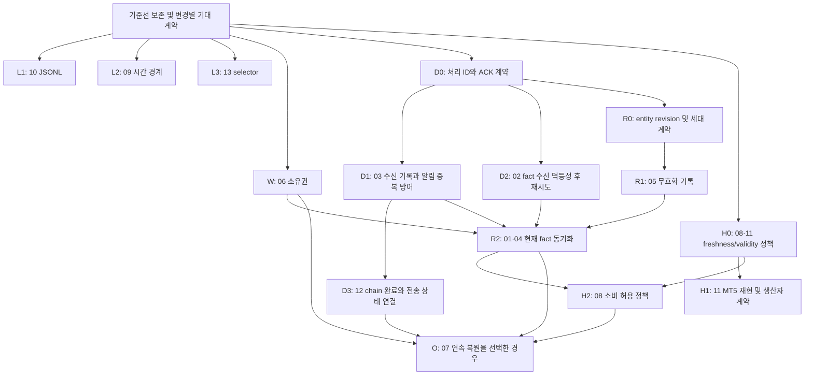

# 의존관계 기반 remediation plan

작성 기준: [발견된 문제 13건](FOUND_ISSUES.md), [현행 계약](INTERPROCESS_CONTRACTS.md), [49개 회귀 테스트](REGRESSION_TEST_MATRIX.md). 이 문서는 후속 수정 계획이다. 운영 소스, 기존 fixture, 기준선 manifest, 기존 테스트의 기대 결과를 변경하지 않았다.

권고: **작은 독립 수정 → 수신 측 중복·역순 방어 → 전달 재시도 → 현재 fact 동기화 → 데이터 유효성 → 선택적인 OZ 후보 복원** 순서로 진행한다. 같은 프로토콜에 속하는 문제는 계약을 함께 정하되 구현과 검증은 작은 변경 단위로 분리한다. 아래 필드명·상태명은 설계 후보이며 현재 존재하는 계약이 아니다.

## 1. 분류 및 수정 단위

| 묶음 | 문제 | 공통 계약 / 묶는 이유 | 독립성 및 선행 조건 |
|---|---|---|---|
| L1 줄 단위 수신 | 10 | JSONL의 완성된 한 줄만 소비 | 독립 수정 가능. queue 전체 재설계·offset 영속화는 제외 |
| L2 시간 경계 | 09 | deadline 동일 시각의 포함/제외 규칙 | 독립 수정 가능. 경계 정책을 먼저 선택 |
| L3 selector 검증 | 13 | 지원하지 않는 SWEEP selector의 처리 | 독립 수정 가능. KIM 기본값·입력·저장 상태의 호환 처리 필요 |
| W watch 소유권 | 06 | PING에서 누가 어떤 watch를 삭제할 수 있는가 | fact/notification 프로토콜과 독립. KIM·OZ 양쪽 계약 필요 |
| D 전달·완료 | 02, 03, 12 | 안정적인 처리 ID, ACK 의미, 재시도 시 부수 효과의 중복 방지, 완료 상태 저장 | 계약 공동 설계. 수신 측 먼저, 송신 재시도 나중 |
| R fact 복원·무효화 | 01, 04, 05 | 현재 상태 집합의 권위, 상태 revision, 재시작 세대, 삭제 기록 | 01·04는 같은 snapshot 동기화로 해결. 05는 동일 lifecycle에 통합하되 제한적 단독 보완 가능 |
| H 데이터 유효성 | 08, 11 | feed freshness와 요청 지표별 validity 구분 | 정책 공동 설계, 구현은 분리. 11은 MT5 재현부터 필요 |
| O OZ 관측 상태 | 07 | 후보·episode·cross의 저장/복원 또는 명시적 cold start | 정책 선택 항목. 연속 복원 선택 시 W·D·R·H의 관련 계약 이후 |

**독립 수정**은 다른 문제의 해결을 기다릴 기술적 이유가 없다는 뜻이다. 동작 변경을 무조건 승인했다는 뜻은 아니다. 09·13은 작은 코드 변경이어도 사용자에게 보이는 의미가 바뀐다.

**공동 계약**도 단일 거대 패치를 뜻하지 않는다. 특히 02의 fact ACK와 03·12의 사용자 알림 완료 ACK는 서로 다른 완료 조건이다. 하나의 `ok`에 모두 합치지 않는다.

## 2. 의존관계

화살표는 이 계획에서의 **적용 순서**다. 다음을 구분한다.

- 필수 계약 의존: D3는 D1의 완료 식별/중복 방어 없이는 안전하게 재시도할 수 없다. R2는 R0의 scope/revision/세대 규칙이 필요하다. O의 연속 복원은 유효한 watch·external 자격·관측 데이터·완료 식별이 필요하다.
- 권고 통합 순서: W·D1·D2를 R2보다 먼저 적용한다. 단순 snapshot 저장 구현 자체가 이들 모두를 필요로 하지는 않지만, 복원된 fact로 Composer가 다시 동작하는 순간 취소·중복·전달 유실 문제가 겹친다.
- 독립 경로: L1/L2/L3는 D/R/H를 기다리지 않는다. H1의 MT5 재현 및 생산자 단위 검증도 R2를 기다리지 않는다. 파일이 겹치는 작업은 코드 통합을 순차 진행한다.
- 범위 제한: 05의 영속 invalidation watermark만 보완하는 작업은 01·04보다 먼저 가능하다. 다만 동일 key의 새 cycle 구분과 과거 JSONL 전체 replay에 대한 보장은 R0 계약을 공유해야 한다.

## 3. 독립 수정 묶음

### L1 — ISSUE-10: JSONL partial line

- 영향: TREND/FVG/SWEEP CommandWorker, OZCommandFileWorker, SweepEventFileWorker의 읽기·offset 처리.
- 수정 범위: newline이 없는 마지막 record는 대기하고 완성된 record까지만 소비한다. 완성됐지만 잘못된 JSON인 줄은 기록 후 건너뛰는 등 처리 정책을 별도로 명시해 영구 정지를 피한다.
- 유지: 명령 파일의 startup EOF, SWEEP 이벤트의 startup offset 0, 기존 append 방식과 action 의미. 이 작업에서 queue 교체, durable offset, 전량 command replay를 추가하지 않는다.
- 통과 기준: 모든 해당 worker에서 두 조각/여러 조각 append, UTF-8 다중 바이트 경계, 정상 줄+partial 줄, 완성된 malformed 줄 다음 정상 줄을 검증한다. 완성 전 적용 0회, 완성 후 적용 1회. 기존 R01/R02와 SWEEP replay 유지.
- 한계: 서로 다른 writer의 바이트 interleave, 파일 회전, 전원손실을 이 수정으로 해결했다고 선언하지 않는다.

### L2 — ISSUE-09: deadline 경계

- 영향: watch_orchestrator의 callback와 maintenance 비교문.
- 선행 결정: `now == deadline`을 허용할지 거절할지 선택한다. 기존 코드가 두 의미를 동시에 가지므로 현재 소스만으로 정답을 확정할 수 없다.
- 수정 범위: 선택한 부등호를 두 경로에 일치시킨다. processing wall time을 event time으로 바꾸거나 deadline을 재시작 시 연장하지 않는다.
- 통과 기준: deadline 직전/정확히/직후 × callback-first/maintenance-first × 재시작 유무에서 동일 판정. 다른 FILTER/UNORDERED 경계는 유지.

### L3 — ISSUE-13: selector

- 영향: SWEEP selector_codes/LEVEL_GROUPS, KIM DEFAULT_SWEEP_LEVELS와 watch/query 입력 검증, 저장 watch 복원.
- 선행 결정: 미지원 항목이 섞이면 전체 거절할지, 지원 항목만 허용하고 거절 항목을 명시할지 선택한다. `생략=기본값`, `명시적 ALL`, `명시적 미지원값`은 구분한다.
- 수정 범위: VAH/VAL 계산을 복원하지 않는다. 명시적 미지원 입력이 조용히 ALL로 확장되는 경로를 차단한다. KIM 기존 기본 목록 때문에 정상 등록까지 전부 실패하지 않도록 생산자와 검증을 한 변경 단위로 맞춘다.
- 통과 기준: VAH 단독, PDL+VAH, ALL, 생략, 빈 목록, 저장된 구형 목록, query와 watch 모두 검증. 지원 selector의 레벨/대표 선택/consumed 동작은 동일.

### W — ISSUE-06: watch 소유권

- 영향: KIM _refresh_oz_after_ping 및 명령 생성 경로, OZ Generic/Manual 저장·복원.
- 최소 계약: 사용자 recipient와 시스템상 삭제 권한을 분리한다. watch마다 소유 종류/소유 ID를 식별하고 PING의 desired 비교는 그 소유 범위 안에서만 수행한다.
- 구형 상태: 소유 정보가 없으면 일괄 KIM 소유로 간주하지 않는다. 기존 chain/child 원장으로 확인 가능한 항목과 독립 watch를 분류하고, 불명확한 항목의 유지/취소 정책을 명시한다. 단순 ID prefix만으로 모든 소유권을 추정하지 않는다.
- 통과 기준: 독립 Generic 유지, 종료된 KIM child 제거, 활성 child 유지, 다른 사용자 watch 보존, 등록 전후 양쪽 재시작, 명시적 CANCEL/RESET 범위 유지. 직접 Manual/FVG-created 후속 경로도 분류 테스트를 추가한다.
- 제외: OZ 후보 저장, fact snapshot, 최종 알림 dedup를 이 패치에 섞지 않는다.

## 4. D — ISSUE-02·03·12: 전달과 완료 계약

### 공통으로 먼저 결정할 것

| 개념 | 제안 계약 | 피해야 할 혼동 |
|---|---|---|
| logical event ID | 재전송·송신자 재시작에도 같은 논리 이벤트는 같은 ID. 별도 발생은 별도 ID | 메시지 문구 hash만으로 ID를 만들지 않음 |
| recipient별 완료 | 동일 event도 수신자별 전달 상태 저장 | 일부 성공 뒤 전체 재시도로 성공 수신자 중복 전송 |
| fact ACK | 수신 상태 반영 및 약속한 복구 기록 완료 | fact accepted를 Telegram delivered로 해석 |
| notification 상태 | pending / delivered / 실패 / 전달 여부 불명 구분 | 타임아웃을 항상 미전송으로 간주 |
| chain 완료 토큰 | chain ID + 해당 완료 occurrence를 고정해 재사용 | 재시도마다 새 event ID 또는 새 chain 실행 |
| 저장 수명 | 최대 재전송·replay 범위와 함께 ledger 보존/정리 정책 결정 | ledger를 먼저 삭제하고 과거 이벤트 재수신 허용 |

알림 전송과 로컬 파일 commit은 하나의 원자적 작업이 아니다. 외부 전송 직후 로컬 완료 기록 전 중단이면 전달 여부가 불명확할 수 있다. 현재 감사로 end-to-end exactly-once를 보장할 근거는 없다. 이 구간은 자동 재시도 시 중복 가능성과 재시도 보류 시 유실 가능성 중 정책을 명시하고 별도 상태로 테스트한다.

### 적용 순서

1. **D0 계약·실패 fixture 먼저:** event identity, ACK 단계, 저장 경계, 재시도 보존 기간을 정의한다. 기존 `ok/delivered` 소비자를 조사하고 새 상태가 구형 bool 해석으로 오인되지 않게 한다.
2. **D1 ISSUE-03 수신 측:** KIM이 동일 ID/recipient 처리 결과를 재사용하도록 하고 OZ 송신자가 ID를 재사용하도록 한다. 알림 ledger와 watch 취소의 crash 간극도 검사한다. ledger만 넣고 producer가 매번 새 ID를 생성하면 해결이 아니다.
3. **D2 ISSUE-02 fact 전달:** KIM의 fact 적용과 Composer 부수 효과가 재전송에 멱등적인 것을 먼저 검증한다. 그 뒤 TREND의 송신 완료 watermark를 ACK 결과와 연결하고 미확인 상태를 재시도한다. 필요 저장 범위는 재시작 보장 수준에 맞춰 정한다.
4. **D3 ISSUE-12 chain 완료:** 마지막 조건 충족 시 고정된 완료 토큰과 전송 대기를 저장한다. KIM에 알림 제출 실패 또는 재시작 시 같은 토큰으로 이어간다. 전달 대기를 이유로 조건 stage를 다시 실행하지 않는다. 확정 실패에서도 대기가 남고, 성공 후 재시도는 새 알림을 만들지 않는다.

D2가 D1 전체 구현을 반드시 기다려야 하는 것은 아니다. 다만 D2의 재전송이 Composer NOTIFY/arm까지 다시 실행한다면 해당 부수 효과의 중복 방어가 선행되어야 한다. 단순히 `_last_watch_state` 대입 위치만 옮겨서 해결 완료로 취급하지 않는다.

### 통과 기준

- 기존 T03/K04/K05/C05를 바탕으로 수신 전 timeout, 반영 후 ACK 유실, 수신자 일부 실패, 송신/수신 단독 재시작을 추가한다.
- 동일 처리 ID는 effect 1회, 다른 ID의 같은 문구는 정상 별도 알림. recipient별 결과도 일치.
- KIM 상태 기록 전후, chain 완료 대기 저장 전후, HTTP 호출 전후, 완료 기록 전후 각각 중단한다.
- HTTP500 시 chain 완료 의도 보존, 재개 후 stage 재실행 0회. HTTP 성공이 확인·저장된 뒤 ACK 유실 시 재알림 0회. 외부 결과 불명 구간은 선택한 정책과 일치.
- fact 전달에는 TREND 상태 수렴 보장과 별개로 중간 모든 전이를 전달할지/최신 상태만 수렴할지 명시한다. 중간 전이는 chain 의미에 영향을 줄 수 있어 임의 병합하지 않는다.

## 5. R — ISSUE-01·04·05: 현재 fact 동기화와 lifecycle

01은 KIM이 현재 fact를 잃는 문제이고, 04는 KIM이 더 이상 유효하지 않은 fact를 잃지 않는 문제다. 둘 다 **해당 scope의 권위 있는 현재 집합**을 엔진에서 받아 대조하는 같은 계약으로 해결한다. 05는 대조 이후 과거 이벤트가 삭제 상태를 되살리지 못하게 하는 lifecycle 계약이다.

### 먼저 정할 최소 계약

- scope: 엔진 종류, symbol/tf, 필요한 watch/selector 소유 범위. 다른 scope의 fact를 삭제하지 않는다.
- sync 요청 ID와 KIM boot 세대: 이전 KIM 요청에 대한 늦은 응답이 현재 상태를 덮어쓰지 않는다.
- producer 세대와 entity revision: 프로세스 restart 때 sequence가 초기화될 경우 비교법을 정의한다. 랜덤 boot ID의 대소 비교나 event_time만으로 전체 순서를 추정하지 않는다.
- 완전한 snapshot 표시와 watermark: 명시적인 빈 집합은 삭제 근거가 되지만, timeout/불완전/STAFF stale은 빈 집합이 아니다.
- snapshot과 동시 delta의 순서: watermark 이전 이벤트의 중복 적용과 이후 이벤트의 누락을 방지한다. 늦은 snapshot이 새 delta를 되돌리지 않는다.
- state와 occurrence 분리: 현재 TOUCH/추세를 복원하는 작업이 과거 FVG_CREATED, Generic trigger, SWEEP 새 touch 발생으로 전달되지 않는다.
- 복원 완료 시 Composer 평가: 부분적으로 채워진 조합의 평가 허용 여부, 이미 소진한 spec/signature/child의 처리, 현재 조건의 새 평가 시점을 명시한다. 알림 dedup만으로 새 child ID 생성 중복까지 해결된다고 가정하지 않는다.
- SWEEP invalidation 기록: watch+방향+level+필요한 cycle 식별에 마지막 revision을 저장한다. 기존 JSONL은 처음부터 replay하므로 보존 기간만 지나 tombstone을 제거하면 과거 TOUCH가 다시 살아날 수 있다. 로그 정리/체크포인트와 보존 범위를 같이 결정한다.

### 적용 순서

1. **R0 공통 계약/fixture:** scope별 snapshot, 세대 변경, 동시 delta, 구형 event를 명세한다. 기존 watch_id/zone_id/level_id의 의미를 재정의하지 않는다.
2. **R1 ISSUE-05:** OZ에서 invalidation 기억을 영속화하고 재시작 후 과거 touch를 차단한다. 동일 key의 정당한 새 cycle은 승인된 식별 규칙으로 통과시킨다. KIM의 유사 역순 경로도 대조 시험하되 별도 발견 사항은 범위를 명시한다.
3. **R2a ISSUE-01:** TREND 한 family로 snapshot/ACK 재시도/부분 실패를 검증한 뒤 FVG/SWEEP로 확장한다. KIM 단독 재시작 시 엔진 방향 변화 없이 현재 fact가 수렴해야 한다.
4. **R2b ISSUE-04:** 같은 프로토콜로 FVG 엔진 재시작 후 active 집합에 없는 KIM touch를 제거한다. 이는 누락된 FILLED 이벤트를 추측 생성하는 작업이 아니다. fill/expiry/상위 3개 추적 제외를 구분해 테스트한다.

### 통과 기준

- 기존 K01/K02/F05/F06/O03과 정상 대조 F04/W01/W02를 사용한다. FVG BEAR, age29→30, 최신 3개 교체도 추가한다.
- KIM만/엔진만 재시작, 시작 순서 변경, sync 중 subscription 변경·취소, 빈 snapshot, 불완전 snapshot, snapshot 뒤 지연 delta 모두 검증.
- 재시작 후 현재 fact 집합이 uninterrupted 기준과 일치. TOUCH 복원이 과거 CREATED/새 setup 알림을 만들지 않으며 이미 소진한 PRIVATE spec을 되살리지 않는다.
- SWEEP TOUCH→INVALIDATED→restart→old TOUCH는 계속 무효. 승인된 새 cycle TOUCH는 정상 수용.
- 중복·역순·재시작이 반복되어도 state, active child, 알림 수가 정한 복원 계약과 일치한다.

## 6. H — ISSUE-08·11: freshness와 지표 validity

두 문제는 공통 health 의미를 정해야 하지만 하나의 패치로 강제 결합하지 않는다. **11만 수정하면 일부 지표가 비어 있는 새 snapshot이 계속 들어올 수 있고, 전체 feed가 fresh라는 이유만으로 그 지표까지 유효하다고 볼 수 없다.** 08은 fact의 수명을 바꾸므로 전략 정책 변경 가능성이 있다.

### 선행 결정

- feed age, 지표별 현재 validity, fact 산출 관측 시점, fact가 논리적으로 지속되는 기간을 분리한다. 재시작 후 복원 수신 시각만 새로 찍어 오래된 관측을 fresh로 만들지 않는다.
- data unavailable과 정상 시장 휴장, crypto 예외를 구분한다. 어느 상태에서 새 Composer arm/NOTIFY를 허용할지 결정한다.
- stale 시 기존 fact를 지울지, 보존하되 새 조합만 막을지, 기존 child도 정지할지 범위를 선택한다. 이 계획에서는 TTL 숫자나 자동 취소 조건을 추가하지 않는다.
- 현재 지표별 최근20봉 all-NaN 검사와 최신 행의 usable 여부는 다를 수 있다. optional 생산 정책을 바꾸기 전에 실제 소비 함수의 NaN 처리와 warmup을 확인한다.

### 적용 순서

1. **H0 문서/fixture:** 위 선택을 먼저 정하고 STAFF 오류와 valid-empty/fresh/partial/stale의 의미를 구분한다.
2. **H1 ISSUE-11:** MT5 CopyBuffer 실패를 재현한다. 원인이 확인되고 partial 송신을 선택했을 때만, 실패 slot을 명시적으로 비우고 정상 OHLC/나머지 slot을 보낼 계약을 적용한다. 기존 45-slot binary를 유지할 수 있으면 유지하고, 추가 health metadata가 필요하면 별도 version 호환 설계를 한다. 오래된 buffer 값을 정상값처럼 재사용하지 않는다.
3. **H2 ISSUE-08:** snapshot/복원 경로까지 관측 시점·validity를 전달하고 KIM에 승인된 소비 정책만 적용한다. 점수·ATR·FVG 유효 봉수·SWEEP 가격 조건은 바꾸지 않는다.

### 통과 기준

- 기존 S03/S04/S06/K03/T04에 더해 RSI만 실패/OHLC 실패/전체 정상 복귀/재접속/restart를 검사한다.
- OHLC-only 소비자와 RSI 소비자가 정한 정책대로 다르게 반응하고, 재시작이나 PING으로 데이터 나이가 초기화되지 않는다.
- feed 복구 시 과거 이벤트가 새 발생으로 재생되지 않는다. 이전에 무효화한 external 상태가 health 회복만으로 살아나지 않는다.
- H1의 MT5 컴파일·실제 실패 주입을 하지 못했다면 구현 검토/오프라인 검증과 분리해 미완료로 표시한다. 현재 ISSUE-11은 정적 확인이지 실험 확정이 아니다.

## 7. O — ISSUE-07: OZ 후보 복구는 마지막 정책 분기

두 선택을 명시적으로 분리한다.

| 선택 | 처리 | 완료 기준 |
|---|---|---|
| 현 cold start 유지 | watch는 복원, 후보는 새 관측부터 시작한다는 운영 계약 확정 | O01 현 기대 결과 유지. 버그 수정 완료가 아니라 의도한 제한으로 수용했다고 기록 |
| 관측 연속성 복원 | 실제 관측한 candidate/episode/cross/extreme/alert 식별을 저장하고 재시작 시 검증 | 끊김 없는 replay와 동일한 후보·무효화·최종 알림, 오래된 후보 재활성화 없음 |

연속성을 선택하는 경우에만 별도 구현한다. 영향은 OZMonitor 상태 저장·복원과 profile/watch/external 연결이다. OHLC 과거봉에서 OUT→IN 경로를 추측하거나 timer를 새로 시작하지 않는다. 관측 공백 중 있었을지 모를 live 전이는 복원할 수 있으리라고 가정하지 않고, 공백 허용 또는 후보 폐기 정책을 결정한다.

필수 추가 시험: 6개 profile × LONG/SHORT, OUT 이전/OUT 중/IN 직후/cross 전후/최종 알림 직전·직후 restart, environment 교체, TRUE B0 timer 경계, 데이터 공백, external invalidation. W의 watch 소유권과 D의 완료 식별이 먼저 검증되어야 복구된 후보가 잘못된 감시에 붙거나 이미 끝난 알림을 다시 만들지 않는다.

## 8. 권장 실행 배치와 종료 조건

| 순서 | 배치 | 변경 단위 | 다음으로 넘어가는 조건 |
|---|---|---|---|
| 0 | 계약 결정과 테스트 준비 | 변경별 기대 계약·새 실패 fixture, 기준선 보존 | 해당 변경의 이전/이후 차이를 테스트로 설명 가능 |
| 1 | L1 → W; L2/L3는 정책 결정 후 각각 | 문제당 별도 패치, 무관한 cleanup 없음 | 관련 정상 대조 + 신규 경계 통과 |
| 2 | D0 → D1 / D2 → D3 | 수신 측·각 생산자·chain commit을 분리 | ACK 유실/재시작/부분 전달 실패 계약 검증 |
| 3 | R0 → R1 → R2a → R2b | lifecycle 방어, TREND부터 family별 동기화 | state 수렴과 과거 이벤트 재실행 방지 동시 통과 |
| 4 | H0 → H1 / H2 | MT5 생산자와 KIM 소비 정책을 분리 | fresh/partial/stale/recovery 및 실제 MT5 증거 |
| 5 | O 선택 분기 | cold start 수용 또는 연속 복원 전용 변경 | 선택한 계약 및 관측 공백 한계가 명시됨 |

H0/H1 조사와 L2/L3 정책 정리는 앞 배치와 독립적으로 진행할 수 있다. 위 순서는 개발 일정/인력 병렬화를 지시하는 것이 아니며 이번 작업에서 병렬 에이전트나 운영 프로세스를 실행하지 않는다.

### 모든 변경의 공통 게이트

1. **기준선과 수정 대상 분리:** 최초 49개 테스트·manifest·원본 증거를 보존한다. 알려진 결함을 assert하는 테스트가 수정본에서 달라지는 것은 예상된 차이다. 기존 assertion을 몰래 바꾸거나 skip하지 않고, 해당 ISSUE의 새 기대 assertion과 전후 결과를 같이 기록한다.
2. **해시의 역할 유지:** 최초 manifest는 최초 소스에 대한 증거로 남긴다. 수정본은 승인된 파일 diff와 별도 revision manifest로 검증한다. 테스트를 통과시키려고 최초 hash를 재생성하지 않는다. 영향 없는 테스트는 계속 동일 결과여야 한다.
3. **범위별 통과:** 해당 문제 시험 + 정상 대조 + 두 전체 흐름 E01/E02를 실행한다. 완료 선언은 그 변경 범위에만 적용하며 13건 전체 해결로 표시하지 않는다.
4. **프로토콜 호환:** 수신자를 먼저 확장하고 새 송신 동작은 필요한 수신 capability가 있을 때만 활성화한다. 구형 모드에서는 새 보장을 주장하지 않는다. 혼합 버전이 안전하지 않으면 조정된 동시 전환으로 명시한다.
5. **상태 migration/rollback:** 저장 파일 version, 구형 상태 fixture, 중간 실패, downgrade 가능 여부를 정한다. 활성화 이후 최신 ledger/tombstone을 오래된 백업으로 되돌리면 재전송/부활이 생길 수 있으므로 단순 소스 rollback과 상태 rollback을 동일하게 취급하지 않는다.
6. **실패 주입:** 새 영속 경계는 write 전/후·replace 전/후·ACK 전/후를 검증한다. 객체 재생성 검증 후 해당 배치의 실제 subprocess 종료/실 ZMQ 시험을 수행한다. 미실행 wire/전원손실 항목을 오프라인 PASS로 대체하지 않는다.

## 9. 13건의 완료 판정표

| ISSUE | 담당 배치 | 해당 문제를 닫기 위한 최소 증거 |
|---|---|---|
| 01 | R2a | KIM 단독 재시작 후 세 엔진의 변하지 않은 현재 fact 복원, 부수 효과 중복 없음 |
| 02 | D2 | 수신 전 timeout 및 ACK 유실 후 동일 상태 전달/반영, 중복 부수 효과 없음 |
| 03 | D1 | 동일 ID/recipient 완료 기록 후 중복 전달 억제, 외부 결과 불명 정책 명시 |
| 04 | R2b | FVG fill/expiry/추적집합 변경과 restart 전후 KIM 현재 집합 일치 |
| 05 | R1 | invalidation 후 restart와 과거 전체 replay에서도 부활 없음, 새 cycle 허용 |
| 06 | W | 독립 watch 보존과 끝난 owned child 제거를 동시에 검증 |
| 07 | O | cold start의 명시적 수용 또는 승인된 관측 연속 복원의 충분한 replay 증거 |
| 08 | H2 | 승인된 stale 정책이 정상 실행과 복원 경로에 동일 적용 |
| 09 | L2 | 경계 시각 결과가 callback/maintenance 순서에 독립 |
| 10 | L1 | 대상 worker 모두 완성 전 미소비, 완성 후 1회 적용 |
| 11 | H1 | MT5 실패 재현과 선택한 생산자 정책, 소비자 validity 결과의 실제 확인 |
| 12 | D3 | HTTP 실패·재시작에 완료 의도 보존, 조건 재실행/확인된 알림 재전송 없음 |
| 13 | L3 | 미지원 selector 처리 명시, 기본값/구형 저장값/지원 selector 동작 정합 |

이번 계획에서 바로 시작할 구현 후보는 **L1(10)**이다. 전략 판정이나 새 이벤트 protocol을 바꾸지 않고 실패 경계를 좁혀 검증할 수 있다. 이후 **W(06)**와 **D0 계약 확정**을 진행한다. 이 문서 작성 자체는 그 구현을 실행하거나 정책 변경을 승인한 것으로 취급하지 않는다.
